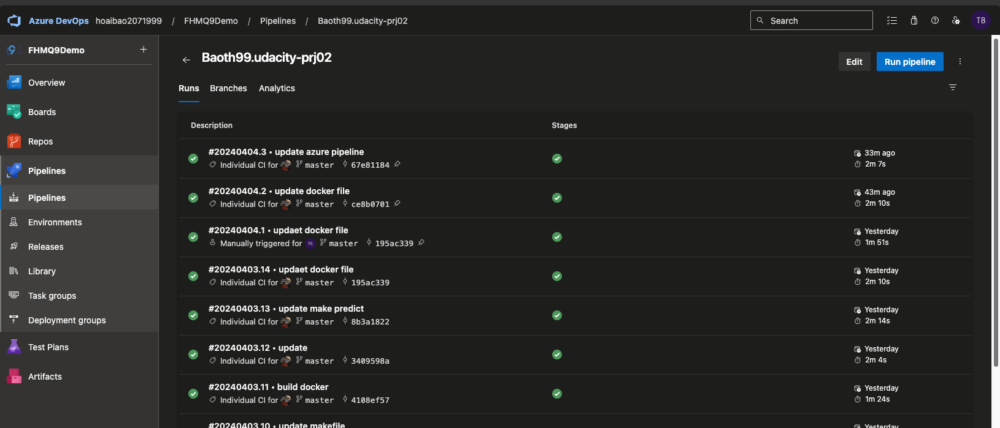

# Overview

Building a CI/CD Pipeline with Azure DevOps Pipelines

## Project Plan
<TODO: Project Plan

* A link to a Trello board for the project
* A link to a spreadsheet that includes the original and final project plan>

## Instructions

<TODO:  
* Architectural Diagram (Shows how key parts of the system work)>

* Project running on Azure App Service
 

* Project cloned into Azure Cloud Shell

* Passing tests that are displayed after running the `make all` command from the `Makefile`

* Output of a test run

* Successful deploy of the project in Azure Pipelines.  
 
 

* Running Azure App Service from Azure Pipelines automatic deployment
 

* Successful prediction from deployed flask app in Azure Cloud Shell.  [Use this file as a template for the deployed prediction](https://github.com/udacity/nd082-Azure-Cloud-DevOps-Starter-Code/blob/master/C2-AgileDevelopmentwithAzure/project/starter_files/flask-sklearn/make_predict_azure_app.sh).
The output should look similar to this:

* Output of streamed log files from deployed application

> 

## Enhancements

Adding more test cases.
Creating a UI for making predictions.
Run the app on AKS instend of App Service

## Demo 

<TODO: Add link Screencast on YouTube>

