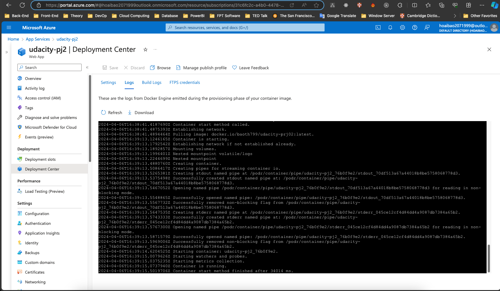
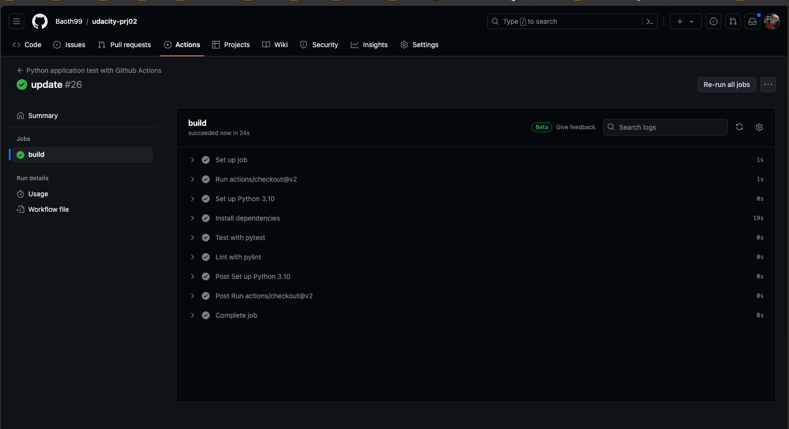

# Overview

Building a CI/CD Pipeline with Azure DevOps Pipelines

## Badges

## Project Plan
<TODO: Project Plan

[* A link to a spreadsheet that includes the original and final project plan>](https://docs.google.com/spreadsheets/d/e/2PACX-1vTG_T01eJ1RdxyhkhZ3O4B6UF5IwXHkApSERZkcUJBJ7rWSUTer0YjSEfdL9Fv4PNmFqsmx78V7CsMq/pubhtml?gid=1568358182&single=true)

## Instructions

<TODO:  
* Architectural Diagram (Shows how key parts of the system work)>

* Project running on Azure App Service
 

* Project cloned into Azure Cloud Shell

 

* Output of a test run

* Successful deploy of the project in Azure Pipelines.  
 
 

Use GitHub action to test and lint project 

Clone and build an application inside of Azure Cloud Shell

Locust test

* Running Azure App Service from Azure Pipelines automatic deployment
 

* Successful prediction from deployed flask app in Azure Cloud Shell.  [Use this file as a template for the deployed prediction](https://github.com/udacity/nd082-Azure-Cloud-DevOps-Starter-Code/blob/master/C2-AgileDevelopmentwithAzure/project/starter_files/flask-sklearn/make_predict_azure_app.sh).
The output should look similar to this:

* Output of streamed log files from deployed application

> 

## Enhancements

Adding more test cases.
Creating a UI for making predictions.
Run the app on AKS instend of App Service

## Demo 

YouTube: https://www.youtube.com/watch?v=9qc7_Ed1bZE

App  URL: https://udacity-pj2.azurewebsites.net/

